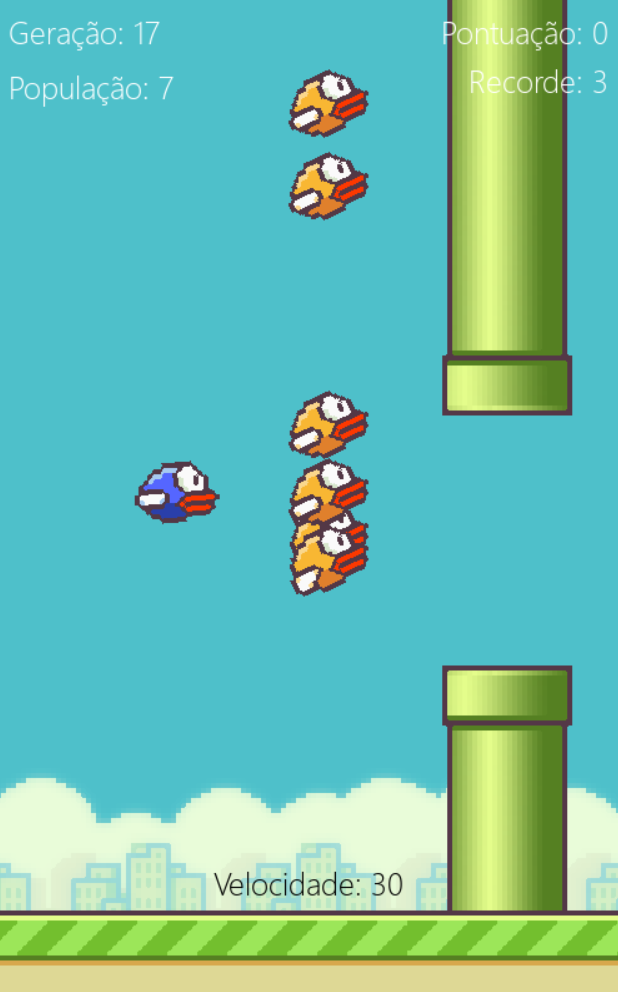
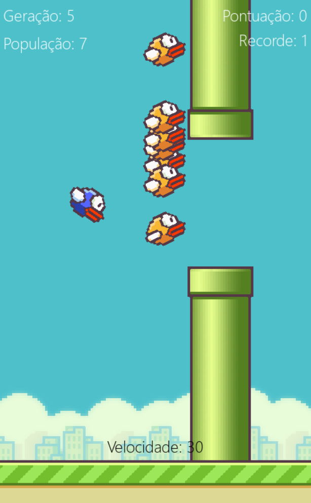
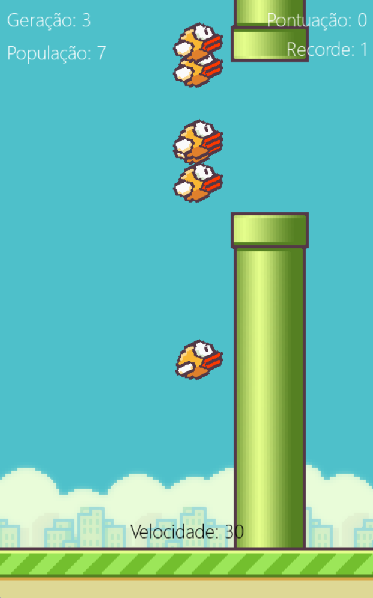
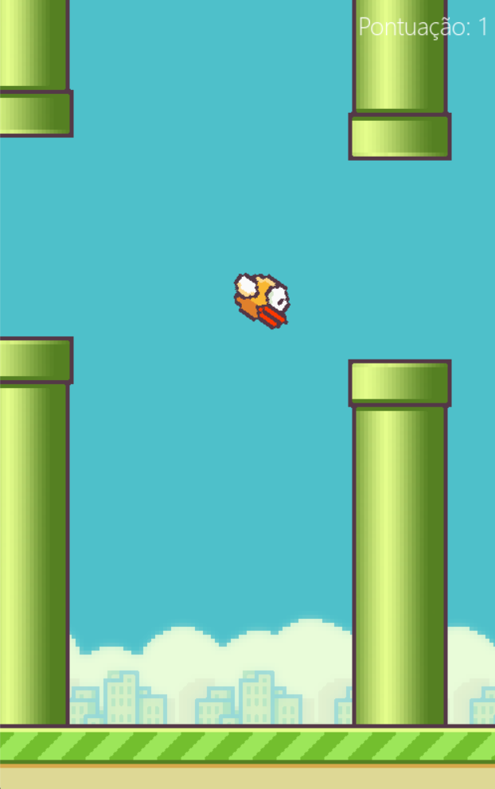
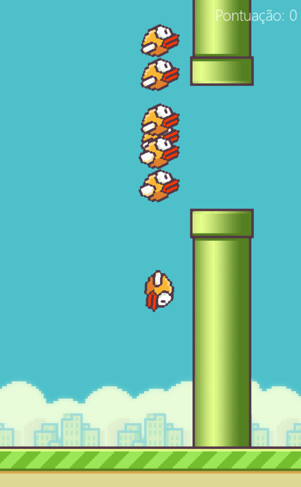

# Flappy Bird com IA

Este projeto, implementado em Python com o auxílio das bibliotecas pygame e neat, foi desenvolvido na Semana da Computação (Secompp) da Unesp FCT, durante o minicurso Flappy Bird com IA (25-26/09/2023).  
Ele consiste em recriar o famoso jogo "Flappy Bird", porém, com a adição de uma inteligência artificial que aprende a jogar da melhor forma possível. Para o game, a biblioteca pygame foi utilizada. Para a IA, a lib neat-python.  

## Projeto base
A princípio, o projeto se propunha a recriar o game e incluir a IA, com a diferença de que os canos se moveriam para cima e para baixo, para aumentar a dificuldade para a IA. A subpasta para esta versão se chama "Flappy base".

### Alterações
Partindo disso, eu decidi incrementar algumas coisas:
- Agora o jogador pode "competir" com a IA, jogando simultaneamente;
- Existem diversos marcadores na tela:
  - Geração atual;
  - Quantos pássaros estão vivos;
  - Recorde geral;
  - Pontuação atual;
  - Velocidade (tick) do game.
- O jogador pode controlar a velocidade com que o jogo roda;
- Apertar Esc fecha o jogo.

## Sobre o jogo

Para jogar, basta executar o arquivo flappy.py da versão de seu interesse. As seguintes versões estão neste repositório:

    
Flappy Bird com IA

    
### Flappy Bird com IA

Ao iniciar o game, os pássaros controlados por IA (amarelos) irão começar a pular com base nos inputs dados pelos genomas. O jogador controla o pássaro azul, que fica um pouco atrás.

Os comandos são:
- Espaço - pular
- Seta para cima - aumenta a velocidade do game
- Seta para baixo - abaixa a velocidade do game
- Esc - fechar

***

    
Flappy AI only

### Flappy AI only

Esta versão é semelhante à versão final (com todos os indicadores na tela, comandos extras etc.), porém, sem a possibilidade do usuário jogar simultaneamente. Aqui a IA joga sozinha.  

***

    
Flappy Player only

### Flappy Player only

Analogamente à versão AI only, aqui apenas o usuário joga. A diferença é que esta versão é a mais próxima do jogo original, em que não há comandos extras (apenas Esc para fechar) ou indicadores além da pontuação atual, e os canos são estáticos.  

***

    
Flappy Base

### Flappy base

Esta é a versão implementada originalmente no curso. Nela, não há comandos para o jogador, apenas se vê a IA tentando achar a melhor forma de passar pelos canos geração após geração.  

***

## Considerações finais

Todos os códigos-fonte estão comentados para facilitar a interpretação de cada seção. A estrutura das pastas é a mesma:  
- Um arquivo `flappy.py`, que contém o código-fonte do game;
- Um arquivo `config.txt`, que contém as configurações de genomas e redes neurais da inteligência artificial; e
- Uma pasta `imgs` com os sprites utilizados no jogo.

É um projeto simples, porém dinâmico, interativo e visual, motivos que me levaram a trazê-lo aqui para integrar meu portfólio.  
Agradecimento especial a [Felipe Freitas](https://github.com/FelipeClabone) e [Lucas Gaspar](https://github.com/lucasgstumpf/), que ministraram o minicurso com excelência e clareza.
